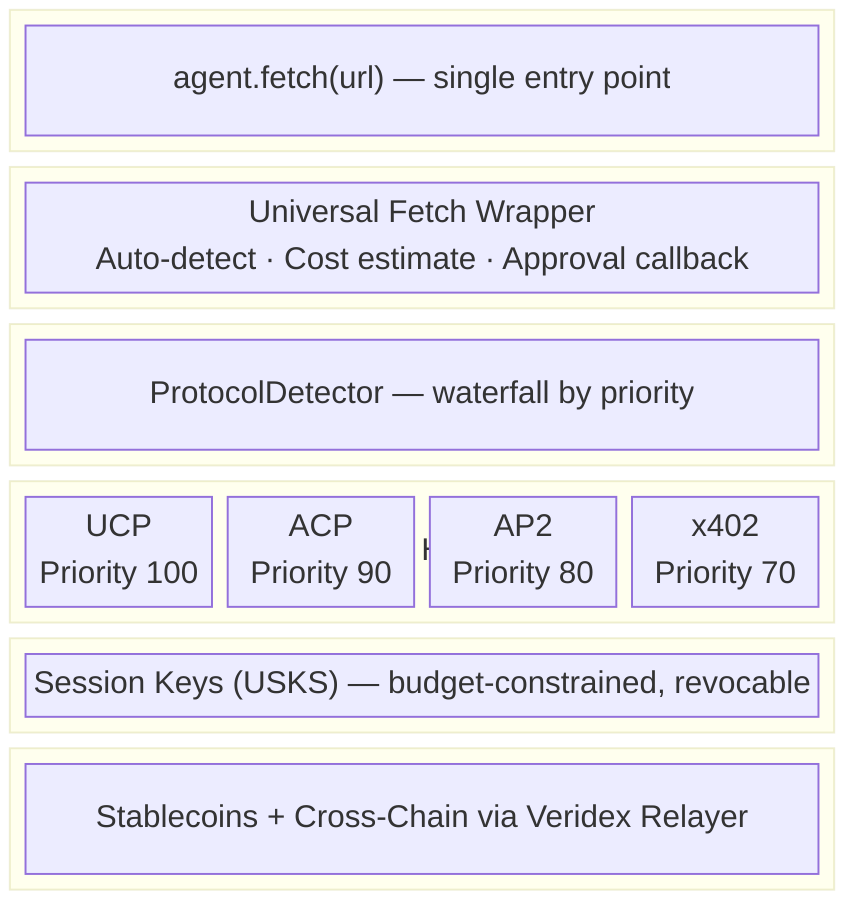
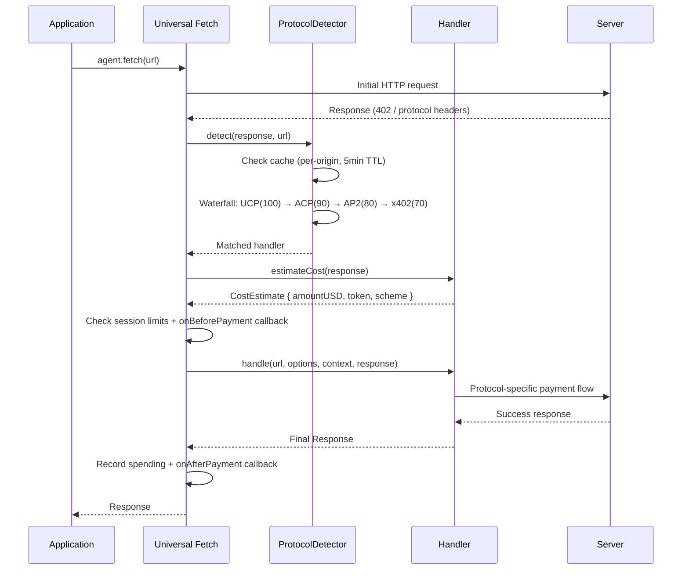

# Agentic Payments Protocol Integration Guide

> **Package:** `@veridex/agentic-payments`  
> **Version:** 2.0.0-beta.1 (Universal Protocol Abstraction Layer — ADR-0025)  
> **Last Updated:** 2026-02-15

## Overview

This guide documents the architecture and integration patterns for the Veridex Agentic Payments SDK's universal protocol support system.

---

## 1. Protocol Architecture

### 1.1 The Protocol Stack



### 1.2 Module Structure (Implemented)

```
src/
├── protocols/                        # Universal Protocol Abstraction Layer
│   ├── base/
│   │   ├── ProtocolHandler.ts       # Abstract base class (canHandle, handle, estimateCost)
│   │   ├── ProtocolDetector.ts      # Waterfall detection with per-origin caching
│   │   ├── types.ts                 # CostEstimate, DetectionResult, UniversalFetchOptions
│   │   └── index.ts
│   ├── x402/
│   │   ├── X402Handler.ts           # 402 + PAYMENT-REQUIRED → ERC-3009 sign → retry
│   │   └── index.ts
│   ├── ucp/
│   │   ├── UCPHandler.ts            # Link/well-known → checkout → credential → complete
│   │   └── index.ts
│   ├── acp/
│   │   ├── ACPHandler.ts            # openai-acp-version → cart → token → complete
│   │   └── index.ts
│   ├── ap2/
│   │   ├── AP2Handler.ts            # x-ap2-mandate-url → validate → fulfill
│   │   └── index.ts                 # Also exports MandateMapper
│   └── index.ts                     # Barrel exports
├── middleware/
│   └── veridexPaywall.ts            # Express middleware + Next.js handler
├── react/
│   └── hooks.ts                     # useFetchWithPayment, useCostEstimate, useProtocolDetection
├── x402/                             # Legacy x402 (still used as fallback)
│   ├── X402Client.ts
│   ├── PaymentParser.ts
│   ├── PaymentSigner.ts
│   └── adapters/
├── ucp/                              # Legacy UCP client
├── session/                          # Session key management
├── chains/                           # Multi-chain clients
├── monitoring/                       # Audit, alerts, compliance
├── routing/                          # Cross-chain routing
├── oracle/                           # Pyth price feeds
└── performance/                      # Connection pool, nonce mgmt
```

---

## 2. Protocol Handlers

### 2.1 Base Protocol Handler

All protocol handlers extend a common interface:

```typescript
// protocols/base/ProtocolHandler.ts

export abstract class ProtocolHandler {
  abstract readonly protocolName: string;
  abstract readonly priority: number;  // Higher = checked first
  
  /**
   * Detect if this handler should process the response
   */
  abstract canHandle(response: Response, url: string): Promise<boolean>;
  
  /**
   * Process the payment flow
   */
  abstract handle(
    url: string,
    options: RequestInit,
    session: StoredSession,
    originalResponse?: Response
  ): Promise<Response>;
  
  /**
   * Estimate cost before payment
   */
  abstract estimateCost(response: Response): Promise<CostEstimate>;
}
```

### 2.2 Protocol Detection Flow



The `ProtocolDetector` caches results per-origin (5-minute TTL) and supports:
- `allowedProtocols` whitelist filtering
- Force-selection via `getHandler(protocolName)`
- Structured metadata via `detectWithMetadata()`

---

## 3. Protocol Implementations

### 3.1 x402 Protocol (Web-Native)

**Trigger:** HTTP 402 status with `PAYMENT-REQUIRED` header

```typescript
// protocols/x402/X402Handler.ts

export class X402Handler extends ProtocolHandler {
  readonly protocolName = 'x402';
  readonly priority = 70;
  
  async canHandle(response: Response): Promise<boolean> {
    if (response.status !== 402) return false;
    return response.headers.has('payment-required') || 
           response.headers.has('x-payment-required');
  }
  
  async handle(
    url: string,
    options: RequestInit,
    session: StoredSession,
    originalResponse: Response
  ): Promise<Response> {
    // 1. Parse payment requirements
    const requirements = this.parser.parse(originalResponse.headers);
    
    // 2. Validate against session limits
    const amountUSD = await this.estimateUSD(requirements);
    this.sessionManager.checkLimits(session, amountUSD);
    
    // 3. Sign payment authorization
    const signature = await this.signer.sign(requirements, session);
    
    // 4. Retry request with payment
    return fetch(url, {
      ...options,
      headers: {
        ...options.headers,
        'PAYMENT-SIGNATURE': signature
      }
    });
  }
}
```

**Header Format:**

```
PAYMENT-REQUIRED: {"chain":8453,"token":"0x833589...","amount":"1000000","recipient":"0x..."}
```

### 3.2 UCP Protocol (Google/Shopify)

**Trigger:** `.well-known/ucp` manifest or `Link: rel="ucp-manifest"` header

```typescript
// protocols/ucp/UCPHandler.ts

export class UCPHandler extends ProtocolHandler {
  readonly protocolName = 'ucp';
  readonly priority = 100;
  
  async canHandle(response: Response, url: string): Promise<boolean> {
    // Check Link header
    const linkHeader = response.headers.get('link');
    if (linkHeader?.includes('rel="ucp-manifest"')) return true;
    
    // Check well-known
    try {
      const origin = new URL(url).origin;
      const manifest = await fetch(`${origin}/.well-known/ucp`);
      return manifest.ok;
    } catch {
      return false;
    }
  }
  
  async handle(
    url: string,
    options: RequestInit,
    session: StoredSession
  ): Promise<Response> {
    // 1. Discover merchant capabilities
    const manifest = await this.discovery.getManifest(url);
    
    // 2. Negotiate checkout
    const checkout = await this.negotiator.createCheckout(manifest, options.body);
    
    // 3. Find Veridex payment handler
    const veridexHandler = checkout.paymentHandlers.find(
      h => h.name === 'dev.veridex.passkey_payment'
    );
    
    if (!veridexHandler) {
      throw new Error('Merchant does not support Veridex payments');
    }
    
    // 4. Generate credential
    const credential = await this.credentialProvider.generate(session, checkout);
    
    // 5. Complete checkout
    return this.checkout.complete(checkout, credential);
  }
}
```

**Manifest Format:**

```json
{
  "id": "shop.example.com",
  "name": "Example Shop",
  "capabilities": ["checkout", "subscriptions"],
  "paymentHandlers": [
    {
      "id": "veridex-handler",
      "name": "dev.veridex.passkey_payment",
      "config": {
        "recipient_address": "0x...",
        "chain_id": 8453,
        "token_address": "0x833589..."
      }
    }
  ]
}
```

### 3.3 ACP Protocol (OpenAI/Stripe)

**Trigger:** `openai-acp-version` header or ACP-specific response body

```typescript
// protocols/acp/ACPHandler.ts

export class ACPHandler extends ProtocolHandler {
  readonly protocolName = 'acp';
  readonly priority = 90;
  
  async canHandle(response: Response): Promise<boolean> {
    return response.headers.has('openai-acp-version') ||
           response.headers.has('x-acp-checkout-url');
  }
  
  async handle(
    url: string,
    options: RequestInit,
    session: StoredSession,
    originalResponse: Response
  ): Promise<Response> {
    // 1. Parse checkout URL
    const checkoutUrl = originalResponse.headers.get('x-acp-checkout-url');
    
    // 2. Get cart details
    const cart = await this.getCart(checkoutUrl);
    
    // 3. Validate limits
    this.sessionManager.checkLimits(session, cart.total);
    
    // 4. Generate payment token
    const token = await this.tokenGenerator.generate(cart, session);
    
    // 5. Complete checkout
    const result = await this.completeCheckout(checkoutUrl, token);
    
    // 6. Re-fetch original resource
    return fetch(url, options);
  }
  
  private async generatePaymentToken(
    cart: ACPCart,
    session: StoredSession
  ): Promise<string> {
    // Create Stripe-compatible token backed by session key
    const payload = {
      cart_id: cart.id,
      amount_cents: Math.round(cart.total * 100),
      currency: cart.currency,
      session_key_hash: session.keyHash,
      timestamp: Date.now(),
      signature: await this.sign(cart, session)
    };
    
    return Buffer.from(JSON.stringify(payload)).toString('base64url');
  }
}
```

### 3.4 AP2 Protocol (Google A2A Mandates)

**Trigger:** `x-ap2-mandate-url` header or A2A context

```typescript
// protocols/ap2/AP2Handler.ts

export class AP2Handler extends ProtocolHandler {
  readonly protocolName = 'ap2';
  readonly priority = 80;
  
  async canHandle(response: Response): Promise<boolean> {
    return response.headers.has('x-ap2-mandate-url') ||
           response.headers.has('x-google-a2a-mandate');
  }
  
  async handle(
    url: string,
    options: RequestInit,
    session: StoredSession,
    originalResponse: Response
  ): Promise<Response> {
    // 1. Get mandate details
    const mandateUrl = originalResponse.headers.get('x-ap2-mandate-url');
    const mandate = await this.getMandate(mandateUrl);
    
    // 2. Map mandate to session constraints
    this.validateMandateAgainstSession(mandate, session);
    
    // 3. Fulfill mandate with Veridex credential
    const fulfillment = await this.fulfillMandate(mandate, session);
    
    // 4. Submit fulfillment
    return this.submitFulfillment(mandateUrl, fulfillment);
  }
}

// protocols/ap2/MandateMapper.ts

export class MandateMapper {
  /**
   * Map a Veridex Session Key to AP2 mandate format
   */
  sessionToMandate(session: StoredSession): AP2Mandate {
    return {
      version: '2026-01',
      cart_mandate: {
        max_value: {
          amount: session.config.dailyLimitUSD,
          currency: 'USD'
        },
        allowed_categories: session.config.allowedCategories || ['*'],
        expires_at: new Date(session.config.expiryTimestamp).toISOString()
      },
      payment_mandate: {
        provider: 'veridex',
        credential_type: 'session_key',
        credential: {
          key_hash: session.keyHash,
          public_key: session.publicKey
        }
      },
      intent_mandate: {
        source: 'user_authorization',
        verified_at: new Date(session.createdAt).toISOString()
      }
    };
  }
  
  /**
   * Validate that a merchant mandate fits within session constraints
   */
  validateMandateAgainstSession(
    mandate: AP2Mandate,
    session: StoredSession
  ): void {
    if (mandate.cart_mandate.max_value.amount > session.config.dailyLimitUSD) {
      throw new Error('Mandate exceeds session daily limit');
    }
    
    const mandateExpiry = new Date(mandate.cart_mandate.expires_at).getTime();
    if (mandateExpiry > session.config.expiryTimestamp) {
      throw new Error('Mandate expires after session');
    }
  }
}
```

---

## 4. Identity Integration

### 4.1 ERC-8004 On-Chain Registry

```typescript
// identity/ERC8004Registry.ts

export class ERC8004Registry {
  constructor(
    private provider: Provider,
    private contractAddress: string = ERC8004_DEFAULT_ADDRESS
  ) {}
  
  /**
   * Register agent identity on-chain
   */
  async registerAgent(
    session: StoredSession,
    metadata: AgentMetadata
  ): Promise<string> {
    const registry = new Contract(
      this.contractAddress,
      ERC8004_ABI,
      this.provider
    );
    
    const profile: ERC8004Profile = {
      name: metadata.name,
      description: metadata.description,
      endpoints: {
        mcp: metadata.mcpEndpoint,
        a2a: metadata.a2aEndpoint
      },
      credentials: {
        session_key_hash: session.keyHash,
        master_key_hash: session.masterKeyHash
      },
      capabilities: metadata.capabilities || ['payment'],
      reputation: {
        transactions: 0,
        success_rate: 100,
        verified_by: []
      }
    };
    
    const tx = await registry.register(profile);
    return tx.hash;
  }
  
  /**
   * Query agent reputation
   */
  async getAgentReputation(agentId: string): Promise<AgentReputation> {
    const registry = new Contract(
      this.contractAddress,
      ERC8004_ABI,
      this.provider
    );
    
    return registry.getReputation(agentId);
  }
  
  /**
   * Verify agent is legitimate
   */
  async verifyAgent(agentId: string): Promise<boolean> {
    const reputation = await this.getAgentReputation(agentId);
    return reputation.verified && reputation.success_rate > 95;
  }
}
```

### 4.2 Visa TAP Trust Signatures

```typescript
// identity/VisaTAPClient.ts

export class VisaTAPClient {
  constructor(private apiKey: string) {}
  
  /**
   * Generate trust signature for merchant verification
   */
  async generateTrustSignature(
    session: StoredSession,
    merchantId: string
  ): Promise<TrustSignature> {
    const payload = {
      agent_id: session.keyHash,
      merchant_id: merchantId,
      timestamp: Date.now(),
      capabilities: ['commerce', 'payment']
    };
    
    // Sign with Visa TAP key
    const signature = await this.signWithTAP(payload);
    
    return {
      payload,
      signature,
      expires_at: Date.now() + 300_000  // 5 minutes
    };
  }
  
  /**
   * Include TAP signature in request headers
   */
  async attachTrustSignature(
    request: Request,
    session: StoredSession
  ): Promise<Request> {
    const merchantId = new URL(request.url).hostname;
    const trustSig = await this.generateTrustSignature(session, merchantId);
    
    request.headers.set('X-Visa-TAP-Signature', trustSig.signature);
    request.headers.set('X-Visa-TAP-Payload', btoa(JSON.stringify(trustSig.payload)));
    
    return request;
  }
}
```

---

## 5. Settlement Layer

### 5.1 Stablecoin Settlement

```typescript
// settlement/StablecoinSettler.ts

export class StablecoinSettler {
  constructor(
    private router: CrossChainRouter,
    private relayerUrl: string
  ) {}
  
  async settle(
    payment: PaymentRequest,
    session: StoredSession
  ): Promise<SettlementReceipt> {
    // 1. Determine optimal route
    const route = await this.router.findOptimalRoute(
      payment.sourceChain,
      payment.targetChain,
      payment.token,
      payment.amount
    );
    
    // 2. Build transaction
    const tx = await this.buildTransaction(route, payment);
    
    // 3. Sign with session key
    const signedTx = await this.signTransaction(tx, session);
    
    // 4. Submit to relayer
    const result = await this.submitToRelayer(signedTx);
    
    return {
      txHash: result.hash,
      sourceChain: payment.sourceChain,
      targetChain: payment.targetChain,
      amount: payment.amount,
      settledAt: Date.now()
    };
  }
}
```

---

## 6. Server Middleware (Universal Multi-Protocol)

The server middleware accepts payments from **any** supported protocol (x402, UCP, ACP, AP2).
When no payment is attached it returns **402** and advertises all enabled protocols so any agent
can detect and pay using its preferred method.

### 6.1 Express — Simplest Usage (All Protocols)

```typescript
import express from 'express';
import { veridexPaywall } from '@veridex/agentic-payments';

const app = express();

// $0.01 USDC paywall — all four protocols enabled by default
app.get('/premium', veridexPaywall({
  amount: '0.01',           // Human-readable USD (auto-converts to raw units)
  recipient: '0xYourAddress',
}), (req, res) => {
  // req.veridexPayment.protocol — which protocol the agent used
  // req.veridexPayment.verified — always true here
  res.json({ data: 'premium content', paidVia: req.veridexPayment.protocol });
});
```

### 6.2 Express — Specific Protocols Only

```typescript
app.get('/api', veridexPaywall({
  amount: '0.50',
  recipient: '0xYourAddress',
  protocols: ['x402', 'ucp'],   // Only advertise x402 and UCP
  network: 'base-sepolia',
  description: 'API access',
}), handler);
```

### 6.3 Next.js API Route

```typescript
import { createPaywallHandler } from '@veridex/agentic-payments';

const paywall = createPaywallHandler({
  amount: '0.01',
  recipient: '0xYourAddress',
});

export default async function handler(req, res) {
  const paid = await paywall(req, res);
  if (!paid) return; // 402 was sent with multi-protocol headers
  res.json({ data: 'premium content' });
}
```

### 6.4 Protocol Discovery Routes (`.well-known`)

Serve `.well-known` endpoints for UCP manifest, ACP checkout, and AP2 mandate negotiation:

```typescript
import { veridexPaywall, createProtocolRoutes } from '@veridex/agentic-payments';

// Mount discovery endpoints at app root
app.use(createProtocolRoutes({
  amount: '0.01',
  recipient: '0xYourAddress',
  merchantName: 'My API',
  description: 'Premium API access',
}));

// Protect routes as usual
app.get('/premium', veridexPaywall({ amount: '0.01', recipient: '0x...' }), handler);
```

This serves:
- `/.well-known/ucp` — UCP manifest with Veridex payment handler
- `/.well-known/acp-checkout` — ACP cart/checkout endpoint
- `/.well-known/ap2-mandate` — AP2 mandate negotiation endpoint

### 6.5 PaywallConfig Reference

| Field | Type | Default | Description |
|-------|------|---------|-------------|
| `amount` | `string` | *required* | Human-readable amount (`'0.01'`) or raw units (`'10000'` with `rawAmount: true`) |
| `recipient` | `string` | *required* | Payment recipient address |
| `protocols` | `ServerProtocol[]` | `['x402','ucp','acp','ap2']` | Which protocols to enable |
| `token` | `string` | USDC on network | Token contract address |
| `network` | `string` | `'base-mainnet'` | Network identifier |
| `rawAmount` | `boolean` | `false` | If true, `amount` is in smallest token units |
| `scheme` | `'exact' \| 'upto'` | `'exact'` | Payment scheme |
| `facilitatorUrl` | `string` | Veridex Relayer | Verification/settlement endpoint |
| `verifyPayment` | `Function` | built-in | Custom `(data, protocol, config) => Promise<boolean>` |
| `description` | `string` | — | Human-readable description for agents |
| `merchantName` | `string` | hostname | Merchant name for UCP/ACP manifests |
| `cartItems` | `Array` | auto-generated | ACP cart items |
| `allowedCategories` | `string[]` | `['*']` | AP2 mandate spending categories |
| `mandateTTLSeconds` | `number` | `300` | AP2 mandate validity duration |

### 6.6 How It Works

1. **No payment headers** → Returns 402 with protocol-specific headers:
   - `PAYMENT-REQUIRED` (base64 JSON) for x402
   - `x-ucp-initiation-url` + `Link` for UCP
   - `openai-acp-version` + `x-acp-checkout-url` for ACP
   - `x-ap2-mandate-url` for AP2

2. **Payment detected** → Auto-detects protocol from request headers:
   - `payment-signature` / `PAYMENT-SIGNATURE` → x402
   - `x-ucp-payment-credential` → UCP
   - `x-acp-payment-token` → ACP
   - `x-ap2-fulfillment` → AP2

3. **Verification** → Protocol-specific validation + Veridex Relayer facilitator (with local fallback)

4. **Settlement** → Async, non-blocking via facilitator

5. **`req.veridexPayment`** attached on success:
   ```typescript
   {
     verified: true,
     protocol: 'x402' | 'ucp' | 'acp' | 'ap2',
     amount: '0.01',
     token: '0x833589...',
     network: 'base-mainnet',
     rawPaymentData: '...',
   }
   ```

---

## 7. React Hooks

### 7.1 useFetchWithPayment

```tsx
import { useFetchWithPayment, AgentWalletProvider } from '@veridex/agentic-payments';

function PaidContent() {
  const { fetchWithPayment, data, isPending, error, detectedProtocol, costEstimate } =
    useFetchWithPayment(wallet);

  return (
    <div>
      <button
        onClick={() => fetchWithPayment('https://api.example.com/premium')}
        disabled={isPending}
      >
        {isPending ? 'Paying...' : 'Get Premium Content'}
      </button>
      {detectedProtocol && <span>Protocol: {detectedProtocol}</span>}
      {costEstimate && <span>Cost: ${costEstimate.amountUSD.toFixed(2)}</span>}
      {data && <pre>{JSON.stringify(data, null, 2)}</pre>}
    </div>
  );
}
```

### 7.2 useCostEstimate

```tsx
import { useCostEstimate } from '@veridex/agentic-payments';

function PricePreview({ url }) {
  const { estimate, isLoading } = useCostEstimate(wallet, url);
  if (isLoading) return <span>Checking price...</span>;
  if (!estimate) return <span>Free</span>;
  return <span>${estimate.amountUSD.toFixed(2)} via {estimate.scheme}</span>;
}
```

### 7.3 useProtocolDetection

```tsx
import { useProtocolDetection } from '@veridex/agentic-payments';

function ProtocolBadge({ url }) {
  const { protocol, isDetecting } = useProtocolDetection(wallet, url);
  if (isDetecting) return <span>Detecting...</span>;
  if (!protocol) return <span>No payment required</span>;
  return <span>Protocol: {protocol}</span>;
}
```

---

## 8. Usage Examples

### 8.1 Basic Usage (Auto-Detection)

```typescript
import { createAgentWallet } from '@veridex/agentic-payments';

const agent = await createAgentWallet({
  masterCredential: userPasskey,
  session: {
    dailyLimitUSD: 100,
    perTransactionLimitUSD: 10,
    expiryHours: 8,
    allowedChains: [30, 2, 23], // Base, Ethereum, Arbitrum
  }
});

// Automatic protocol detection — works for x402, UCP, ACP, AP2
const response = await agent.fetch('https://any-merchant.com/api');
```

### 8.2 Protocol-Specific Override

```typescript
const response = await agent.fetch('https://merchant.com/api', {
  protocol: 'ucp',  // Force UCP even if x402 is available
});
```

### 8.3 With Payment Approval Callback

```typescript
const response = await agent.fetch('https://merchant.com/api', {
  onBeforePayment: async (estimate) => {
    console.log(`About to pay $${estimate.amountUSD} via ${estimate.scheme}`);
    return estimate.amountUSD < 10; // Auto-approve under $10
  },
  onAfterPayment: (settlement) => {
    console.log(`Paid via ${settlement.protocol}: ${settlement.txHash}`);
  },
});
```

### 8.4 Cost Estimation Without Payment

```typescript
const estimate = await agent.estimateCost('https://merchant.com/api');
if (estimate) {
  console.log(`This will cost $${estimate.amountUSD} via ${estimate.scheme}`);
}
```

### 8.5 Custom Protocol Handler

```typescript
import { ProtocolHandler } from '@veridex/agentic-payments';

class MyCustomHandler extends ProtocolHandler {
  readonly protocolName = 'custom' as any;
  readonly priority = 110; // Higher than UCP

  async canHandle(response: Response) {
    return response.headers.has('x-my-custom-protocol');
  }

  async handle(url, options, context, response) {
    // Custom payment logic
    return fetch(url, options);
  }

  async estimateCost(response) {
    return { amountUSD: 0, amountRaw: '0', token: 'USD', chain: 0, scheme: 'custom', confidence: 1 };
  }
}

agent.getProtocolDetector().registerHandler(new MyCustomHandler());
```

---

## 9. Testing

### 9.1 Unit Tests (257 passing)

```bash
npx vitest run                          # All tests
npx vitest run tests/protocols.test.ts  # Protocol handlers (33 tests)
npx vitest run tests/middleware.test.ts # Server middleware (36 tests)
```

**Protocol tests** cover:
- ProtocolDetector: registration, priority ordering, detection, caching, filtering
- X402Handler: detection, cost estimation
- UCPHandler: Link header, x-ucp-initiation-url, .well-known/ucp
- ACPHandler: openai-acp-version, x-acp-checkout-url
- AP2Handler: x-ap2-mandate-url, x-google-a2a-mandate
- MandateMapper: session → mandate conversion
- Priority ordering: UCP > ACP > AP2 > x402

**Middleware tests** cover:
- Config defaults: minimal config, human-readable amounts, raw amounts, per-network USDC
- Protocol advertising: x402/UCP/ACP/AP2 headers in 402 response, protocol filtering
- Incoming detection: all four protocol headers, case-insensitive x402
- Verification: built-in x402 (recipient, amount, expiry), custom verifiers, error handling
- Protocol filtering: reject disabled protocols, accept enabled
- createPaywallHandler: Next.js handler mode
- createProtocolRoutes: .well-known/ucp, .well-known/acp-checkout, .well-known/ap2-mandate

---

## 10. Migration Guide

### From v0.x/v1.x to v2.x (Universal Protocol Support)

```typescript
// v0.x - Manual protocol handling
const x402Response = await agent.x402.fetch(url);
const ucpResponse = await agent.ucp.checkout(cartUrl);

// v2.x - Automatic protocol detection (recommended)
const response = await agent.fetch(url);  // Works for any protocol
```

### Non-Breaking Changes

- `agent.fetch()` now auto-detects protocols (backward compatible — still handles x402)
- `agent.pay()` still works for direct transfers
- All existing exports are preserved

### New APIs

| API | Description |
|-----|-------------|
| `agent.fetch(url, { protocol })` | Force a specific protocol |
| `agent.fetch(url, { onBeforePayment })` | Approval callback before payment |
| `agent.fetch(url, { maxAutoApproveUSD })` | Auto-approve limit |
| `agent.estimateCost(url)` | Estimate cost without paying |
| `agent.getProtocolDetector()` | Access detector for custom handlers |
| `veridexPaywall(config)` | Express middleware (all protocols) |
| `createPaywallHandler(config)` | Next.js/generic handler (all protocols) |
| `createProtocolRoutes(config)` | `.well-known` discovery endpoints |
| `useFetchWithPayment(wallet)` | React hook for paid fetches |
| `useCostEstimate(wallet, url)` | React hook for price previews |
| `useProtocolDetection(wallet, url)` | React hook for protocol detection |

---

## 11. References

- [ADR-0024: x402 and Agentic Payments Strategy](../../docs/architecture/decisions/0024-x402-and-agentic-payments-strategy.md)
- [ADR-0025: Universal Protocol Abstraction Layer](../../docs/architecture/decisions/0025-universal-protocol-abstraction-layer.md)
- [x402 Protocol (Coinbase)](https://github.com/coinbase/x402)
- [Thirdweb x402 Client](https://portal.thirdweb.com/x402/client)
- [ERC-8004 Draft Specification](https://ethereum-magicians.org/t/erc-8004-trustless-agents)
- [Google A2A/UCP Documentation](https://developers.google.com/assistant/agent-commerce)
